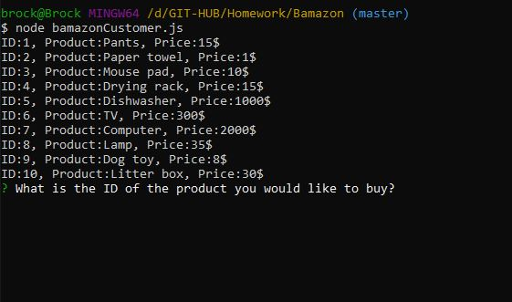
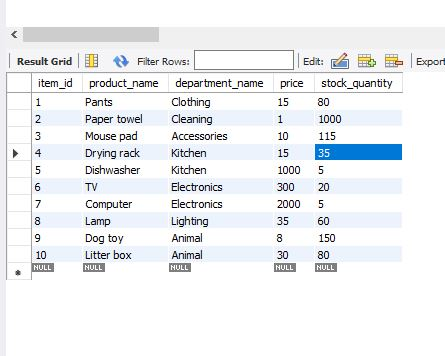

# Bamazon

Bamazon is a simplified version of amazon where items are listed to buy, they each have a corresponding column in mysql. 

## Technologies used:
* `Node.js`
* `Javascript`
* `mysql`

## npm packages:
* `inquirer - To give users input options`
* `mysql - conatining all data on pruducts`

## How to Run BamazonCustomer

### Step One: display the availble items.
the folowing information should be shown in the command line/bash:

  ```
  1.item_id
  2.item name
  3.item price
  ```

### Step two: prompt the user to make a selection and a quantity.
the folowing information should be shown in the command line/bash:

  ```
What is the ID of the product you would like to buy?
How many would you like?
  ```


### Step three: update and give total.
the folowing information should be shown in the command line/bash:

  ```
Your total is _____
  ```
## Images







## How to Run BamazonManager

### Step One: Select option.
the folowing information should be shown in the command line/bash:

  ```
  what would you like to do? (Use arrow keys)
  1.View Products for sale
  2.View Low Inventory
  3.Add to inventory
  4.Add new product
  5.Exit
  ```

### Step two: View products for sale.(display all items)
the folowing information should be shown in the command line/bash:

  ```
Item_id: ,product: , price: , Quantity: .(for each item in the table)
  ```

### Step three: View Low Inventory. (display any item with less than 5 items)
the folowing information should be shown in the command line/bash:

  ```
id: , product: , Quantity
  ```
  
### Step four: Add to Inventory. (select product id to add to, then add amount)

  ```
What is the ID of the product you would like to add inventory too? 
How many would you like to add? 
  ```
  
### Step five: Add New product. (add a completely new product to the store.)

  ```
What is the product name you would like to add? 
What is the department? 
What is the price? 
How many are you adding? 
  ```

### Step six: Exit. (end program)


## Images


## Author
Brock Horton 
